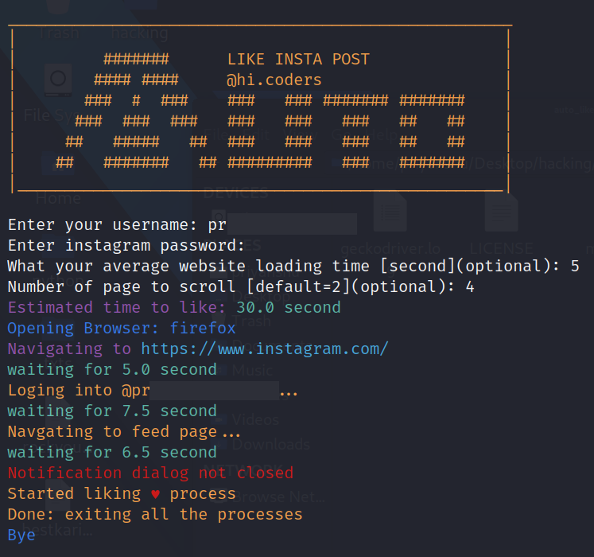

# AUTO LIKE INSTA POST (BOT)

simple auto liking instagram posts.

This app can like your feed posts or single user posts.

### Install requirements.txt

> make sure to have selenium drivers for the browsers in **PATH**.

```
$ pip install -r requirements.txt
```

### Run

run the app just by running the following command.

```
$ python main.py
```

Follow user and likes his all post by running following command.

> If you don't want to follow the user but want to just like his post then omit the "`-f true`" flag

```
$ python main.py -u rollsroycecars -f true
```

## Supported browsers

-   chrome
-   firefox
-   opera
-   safari
-   Edge
-   IE

```
$ python main.py -b firefox
$ Enter your username: YOUR_USERNAME
$ Enter instagram password: YOUR_PASSWORD
```

### Help for app.

open help for the app.

```
$ python main.py --help
```

```
help for AUTO LIKE INSTA POST.

help        -h  --help open help for AUTO LIKE INSTA POST.
browser     -b <option> --browser <option> opens your favorite browser.
            supported browsers [chrome, firefox, safari, edge, ie].
headless    -hl runs browser in headless mode.
            supported headless browsers are [chrome, firefox]
user        -u <username> likes all post of the users from your account.
follow      -f [-u <username> -f <true>] include -f true flag to follow user and like.
```

### Selenium browser webdriver

download drivers for your browser.

-   chrome [ChromeDriver](https://sites.google.com/a/chromium.org/chromedriver/home)
-   firefox [geckodriver](https://github.com/mozilla/geckodriver/releases)
-   opera [OperaChromeDriver](https://sites.google.com/a/chromium.org/chromedriver/home)
-   safari [SafariDriver](https://developer.apple.com/safari/download/)
-   Edge [edgeDriver](https://developer.microsoft.com/en-us/microsoft-edge/tools/webdriver/#downloads)
-   IE [IEDriverServer](http://selenium-release.storage.googleapis.com/index.html)

## Screenshot



## Thank You 🙏
